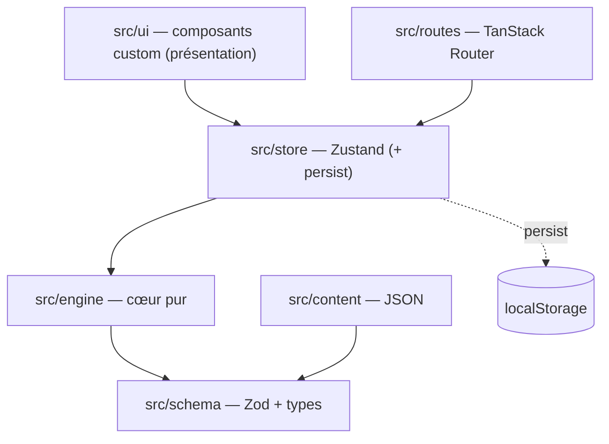
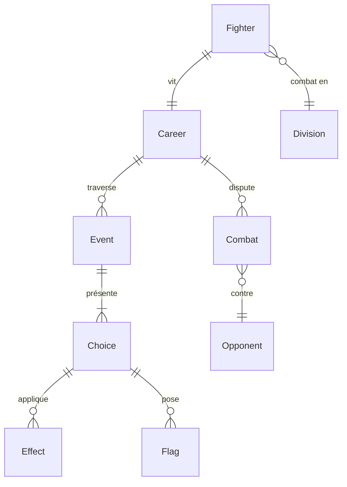

# Architecture Spine — MMA Choice

## Design Paradigm

**Functional Core, Imperative Shell**, avec une **couche de contenu pilotée par la data**.

- **Cœur fonctionnel** (`src/engine/`) — toutes les règles du jeu sous forme de fonctions **pures et déterministes** : `reduce(state, action) => state`. Aucune I/O, aucun framework, aucun accès au DOM/stockage. C'est le seul endroit où vivent les règles.
- **Coquille impérative** — l'état applicatif (`src/store/`, Zustand), la navigation (`src/routes/`, TanStack Router), l'affichage (`src/ui/`, composants custom React + tokens CSS) et la persistance (localStorage). La coquille orchestre et affiche ; elle ne décide de rien.
- **Contenu = data** (`src/content/` + `src/schema/`) — Événements, adversaires, divisions, critères de départ, en JSON validé par des schémas Zod. Le cœur consomme le contenu via ces types validés.

La règle de dépendance qui découle du paradigme (détaillée en AD-1) :



Le sens des flèches est un **invariant** : `engine` ne dépend jamais de `store`/`ui`/`routes`.

## Invariants & Rules

### AD-1 — Cœur fonctionnel / coquille impérative [ADOPTED]
- **Binds :** toute la logique de jeu ; FR-4..FR-16
- **Prevents :** la logique qui fuit dans les composants ou le store → code non testable, règles dupliquées, divergence entre les 3 modes de jeu
- **Rule :** Toutes les règles du jeu vivent dans `src/engine` sous forme de fonctions pures. `src/engine` **n'importe rien** de React, Zustand, TanStack Router ou du DOM. `store`/`ui`/`routes` peuvent importer `engine` ; jamais l'inverse. Les 3 modes (Faire ma carrière / Revivre / Mission du jour) réutilisent le **même** moteur.

### AD-2 — État unique, voie de mutation unique [ADOPTED]
- **Binds :** `GameState`
- **Prevents :** deux propriétaires de l'état, mutations ad hoc éparpillées
- **Rule :** Il existe un seul objet canonique `GameState`. La **seule** façon de le faire évoluer est de dispatcher une `Action` au reducer du moteur. Le store Zustand détient le `GameState` courant et expose des actions qui appellent le reducer puis posent le résultat ; les composants ne mutent jamais l'état directement.

### AD-3 — Hasard déterministe à graine [ADOPTED]
- **Binds :** toute source d'aléatoire dans le moteur ; FR-10, FR-14, FR-16
- **Prevents :** carrières/scores non reproductibles ; impossibilité d'un futur « défi du jour » identique pour tous
- **Rule :** Tout l'aléatoire passe par un PRNG **à graine** dont l'**état sérialisable** (graine + compteur d'étapes, ou l'état interne exposé par pure-rand) est stocké **dans** `GameState` et suffit à le reconstruire à l'identique après rechargement. `Math.random()` est **interdit** dans `src/engine`. À graine + choix identiques, une carrière est rejouée à l'identique (score reproductible — FR-14).

### AD-4 — Le contenu est de la data, pas du code [ADOPTED]
- **Binds :** Événements, adversaires, divisions, critères de départ ; FR-7
- **Prevents :** un ajout de contenu qui exige de toucher au moteur/UI ; la dérive de forme du contenu
- **Rule :** Tout le contenu est du **JSON** validé par **un schéma Zod** par type de contenu ; le type TypeScript est **dérivé** via `z.infer` (source unique de vérité). Le moteur ne consomme le contenu qu'à travers ces types validés. Ajouter/éditer du contenu = éditer du JSON, **zéro** changement de code moteur/UI. Un contenu invalide **échoue au build/chargement**, jamais silencieusement en jeu. Les **ids sont globalement uniques** par type de contenu — la validation au chargement rejette tout doublon d'id. Les **instances d'`Opponent` ne sont pas du contenu authoré** : le contenu ne fournit que des **archétypes/gabarits** d'adversaire (data) ; le moteur en dérive l'instance concrète (AD-3, cf. `engine/combat`).

### AD-5 — Le contenu déclare, le moteur décide
- **Binds :** schéma d'Événement (effets, conditions de déclenchement, flags) ; FR-7, FR-9
- **Prevents :** de la logique impérative planquée dans le contenu ; du contenu capable d'actions arbitraires
- **Rule :** Les Choix d'un Événement déclarent des **effets purement données** et des **conditions déclaratives**. Effet = `{ target, op, value }` où `target` appartient à un **enum de canaux fermé et versionné** (ex. `striking`, `grappling`, `cardio`, `health`, `mental`, `reputation`, `followers`, `money`, `flag`) — **jamais** un chemin libre dans `GameState`, et **jamais** un interne du moteur (`rng`, `saveVersion`, flags « vu ») ; `op` appartient à un ensemble fermé (`add`, `sub`, `set`…). Les conditions ciblent ces **mêmes canaux** via une forme de prédicat fermée (`{ target, cmp, value }`). Le contenu ne contient **jamais** de code exécutable. Ajouter un *type* d'effet/condition ou un canal se fait **dans le moteur** (ensemble versionné), pas par événement. Après application, les stats/jauges sont **bornées à `0–100`** par le moteur.

### AD-6 — Sélection pondérée et anti-répétition, pilotées par flags
- **Binds :** constitution du Pool d'événements ; FR-7, FR-8, FR-9
- **Prevents :** événements répétés dans une même carrière ; pools non bornés
- **Rule :** Le moteur construit le Pool éligible en filtrant tous les Événements sur leurs conditions de déclenchement au regard du `GameState` courant, **exclut** ceux dont le flag « vu » est posé (sauf `repeatable: true`), puis pioche par **tirage pondéré à graine** (AD-3). Le Pool est **trié par id** avant le tirage, pour que l'ordre de chargement des fichiers n'influe pas sur le résultat déterministe (AD-3). Jouer un Événement non répétable pose son flag « vu ». Un flag peut porter un **délai** (conséquence différée) : l'Événement associé n'entre dans le Pool qu'une fois le délai écoulé. **Anti-blocage (invariants) :** le Pool n'est **jamais vide** — au moins un Événement « filler » répétable reste toujours éligible par phase de carrière ; un Événement `repeatable` porte un **cooldown/cap** l'empêchant d'être resélectionné en boucle immédiate.

### AD-7 — Frontière de persistance : localStorage, propriétaire unique [ADOPTED]
- **Binds :** sauvegarde/chargement
- **Prevents :** écritures de stockage éparpillées ; dérive de sérialisation
- **Rule :** Le middleware `persist` de Zustand est le **seul** écrivain de localStorage, sous **une** clé versionnée (`mmachoice.save.v1`). `GameState` doit être **JSON-sérialisable** : pas d'instances de classe ni de fonctions dans l'état (le RNG y est stocké en état sérialisable, pas en closure — cf. AD-3). L'état référence le contenu **uniquement par id** (`eventId`, `divisionId`…) — **jamais** d'objet de contenu embarqué (évite le contenu périmé figé dans les sauvegardes et le double-propriétaire d'entité). Un champ `saveVersion` permet une future migration.

### AD-8 — La route ne possède pas l'état de jeu
- **Binds :** navigation (`src/routes`)
- **Prevents :** l'état de jeu qui diverge entre l'URL et le store
- **Rule :** TanStack Router possède la navigation entre écrans (accueil / création / carrière / combat / récap). Le `GameState` (store) est la source de vérité, **pas** l'URL. Les routes **lisent** le store ; elles ne détiennent pas d'état de jeu. Le deep-link au milieu d'une carrière est hors périmètre V1.

### AD-9 — Front-only, déploiement statique [ADOPTED]
- **Binds :** déploiement / exploitation
- **Prevents :** l'apparition rampante de dépendances serveur
- **Rule :** La V1 se compile (Vite) en **assets statiques** servis par un hébergement statique/CDN. **Aucun backend**, aucun serveur d'exécution, aucun appel réseau pour le gameplay. Tout l'état est côté client.

## Consistency Conventions

| Concern | Convention |
| --- | --- |
| Nommage | Entités & types en `PascalCase` (`Fighter`, `Event`, `Choice`, `Effect`, `Opponent`, `Division`). Fonctions du moteur pures et verbales (`reduce`, `buildPool`, `resolveCombat`, `computeScore`). Ids de contenu = slugs stables `kebab-case` (`evt-amateur-first-fight`, `div-lightweight`). |
| Data & formats | Ids = `string` (slugs). Contenu validé par Zod ; type dérivé via `z.infer` (jamais redéclaré). Poids = entiers positifs. Stats & jauges normalisées sur `0–100`. Argent = entier. Un effet = un objet `{ target, op, value }` déclaratif, jamais du code. |
| State & cross-cutting | Mutation **uniquement** via le reducer du moteur (AD-2). Erreurs de contenu = **échec au chargement** (Zod throw), pas de dégradation silencieuse. Pas de couche de logging (jeu client). Constantes de réglage regroupées (`src/engine/config.ts`). Pas d'auth en V1. Langue V1 = français (textes dans le contenu). |
| Cible & responsive | **Mobile-first** : le smartphone est la cible primaire (UJ-1, joueur dans le métro) ; layouts responsive, zones tactiles confortables. |
| Garde-fous (lint/CI) | Règle ESLint de **frontière d'import** : `src/engine` ne peut importer ni React, ni `store`, ni `ui`, ni `routes` (AD-1). `Math.random` **banni** dans `engine` (`no-restricted-globals`, AD-3). La **validation Zod du contenu** tourne au **build** (étape de CI) : un contenu invalide casse le build (AD-4). Tests unitaires du cœur pur via Vitest. |

## Stack

| Name | Version |
| --- | --- |
| TypeScript | latest (à épingler au bind) |
| React | 19.2.x |
| TanStack Router | 1.170.x |
| UI — composants **custom** (React + tokens CSS de DESIGN.md) | pas de lib de composants à licence ; lib **headless gratuite** (Radix/Ark) en option pour dialog/sheet a11y |
| Zustand (+ middleware `persist`) | 5.0.x |
| Zod | 4.4.x |
| Vite | 8.x |
| pure-rand (ou mulberry32 inline) | 8.4.x — PRNG à graine |

## Structural Seed

Arborescence source (scaffold, pas un miroir à maintenir) :

```text
src/
  engine/            # CŒUR PUR — aucun import framework (AD-1)
    state.ts         #   type GameState + état initial
    actions.ts       #   type Action (union fermée)
    reducer.ts       #   reduce(state, action) => state (AD-2)
    events.ts        #   buildPool + tirage pondéré + flags (AD-6)
    combat.ts        #   résolution graduée + génération d'adversaire (AD-3, FR-10/16)
    meta.ts          #   règles argent/social/santé (FR-11/12/13)
    score.ts         #   score de carrière /100 (FR-14)
    rng.ts           #   PRNG à graine, état sérialisable (AD-3)
    config.ts        #   constantes de réglage
  schema/            # CONTRAT DE CONTENU — schémas Zod + types z.infer (AD-4/5)
  content/           # DATA pure (AD-4)
    events/*.json
    divisions.json
    starting-criteria.json
    opponent-archetypes.json   # gabarits (data) ; les instances sont générées (AD-3/4)
  store/             # Zustand + persist(localStorage) (AD-2, AD-7)
  routes/            # écrans TanStack Router (AD-8)
  ui/                # composants custom présentationnels (React + tokens CSS)
```

Entités cœur (noms + relations ; un attribut qui est lui-même un invariant est un AD, pas ce diagramme) :



## Capability → Architecture Map

| Feature / FR (PRD) | Lives in | Governed by |
| --- | --- | --- |
| Création — sexe/pays/âge, critères, division, style (FR-1,2,3,15) | `routes/create` + `engine/state` + `content/starting-criteria`, `content/divisions` | AD-4, conventions |
| Progression annuelle, paliers, dashboard (FR-4,5,6) | `engine/reducer` + `store` + `ui` | AD-1, AD-2 |
| Moteur d'événements — pools, flags, différé (FR-7,8,9) | `engine/events` + `content/events` + `schema` | AD-4, AD-5, AD-6 |
| Combat gradué + génération d'adversaire (FR-10,16) | `engine/combat` | AD-1, AD-3 |
| Systèmes méta — argent/sponsors/social/santé (FR-11,12,13) | `engine/meta` | AD-1, conventions |
| Fin de carrière & score /100 (FR-14) | `engine/score` | AD-3 (reproductibilité) |

## Deferred

- **Formule exacte du score /100** (PRD §8) — réglage/tuning, pas une décision structurelle ; vit dans `engine/score.ts` + `config.ts`.
- **Algorithme de génération d'adversaire** — interne au moteur (`engine/combat`), déterministe (AD-3), calibré à partir des archétypes authorés (AD-4) ; le code en est propriétaire.
- **Outillage d'authoring de contenu / pipeline de génération IA** — V1 = JSON écrit à la main ou généré par IA, validé par Zod (le contrat AD-4 suffit). Revisiter quand le volume l'exigera.
- **Modes « Revivre » et « Mission du jour »** — même moteur (AD-1) ; ne restent à définir que le contenu et la config de graine. Reportés hors V1.
- **Méta-progression persistante** (badges/Panthéon/défi quotidien) — la porte est ouverte par localStorage (AD-7) ; `saveVersion` permettra la migration.
- **Éventuelle lib headless gratuite** (Radix/Ark) pour les primitives a11y-sensibles (dialog, bottom-sheet) — à décider au moment de les construire ; jamais de lib de composants sous licence (PrimeReact 11 écarté pour cause de licence/bannière).
- **Setup de tests** (ex. Vitest sur le cœur pur) — impliqué par AD-1, pas un invariant.
